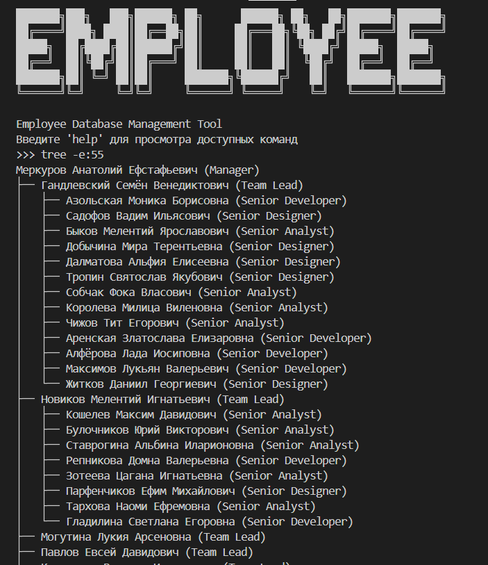

# EMPLOYEE 🔍

**Enterprise Employee Database Management System**

[](https://shields.io/)

A high-performance command-line utility for managing enterprise employee databases with support for 50,000+ records. Features hierarchical organization, advanced search, and bulk operations.



## ✨ Features

- **CLI Interface** - Full keyboard-driven management
- **Hierarchical Management** - Visual org charts with `tree` command
- **Advanced Search** - Filter by any field combination
- **Data Generation** - Instant test datasets with `gendb`
- **Multi-language Support** - Built-in localization (EN/RU)
- **Validation System** - 20+ integrity checks and constraints
- **Audit Logging** - All changes tracked automatically

## 🚀 Installation

```bash
git clone https://github.com/yourrepo/employees.git
cd employees
pip install -r requirements.txt

```
## ⚙️ Configuration

### Environment Variables
Create `.env` file in project root.
Required variables:
```ini
# Database configuration
DB_HOST=localhost
DB_PORT=5432
DB_NAME=employees
DB_USER=admin
DB_PASSWORD=your_strong_password
# Application settings
INITIAL_DATA_COUNT=50000
LANGUAGE=ru  # en/ru
```
## 📖 Basic Usage

```bash
python app/main.py
```
On first running init dataset by command `gendb`.
⚠️ **Warning:** Always back up your database before performing destructive operations. Use `gendb` command with caution.

